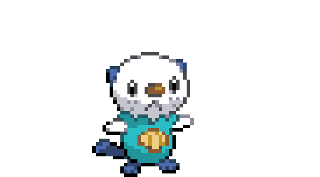
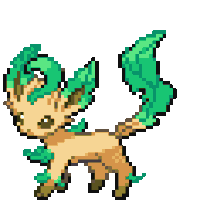

  
  <h6>Hello, I am</h6><h1>Santiago Hernández Sotomonte 👋</h1>

 

<h3 border='0'>Some proyects I have made...</h3>
   

<table>
  <td></td>
  <td></td>
  <td></td>
  <td></td>
</table>

  

<table><td>

  - 🔭 I’m currently working on [**Renova**](https://renovacol.vercel.app) for the FEDESOFT National contest with other people in representation for the school for second time!

  - 🌱 I’m currently learning **how can AI Agents infuence the development in specific areas like learning and teaching**.

  - ☁️ I've keen interest in VideoGames and Web-Apps. So, I'm learning **Unity** and **TypeScript**

  - 💬 I have written code in **Python, Web Tech, Next.js and Unity**!

  - 📫 Feel free to write me through my e-mail: <a href='mailto:santililchyn0@gmail.com'>**santililchyn0@gmail.com**</a>

  - 🏠 You can always send me a **👋** on Discord –  [**Combinah**](https://discordapp.com/users/756268192506052661)! 

</td></table>
<h3>Who am I?</h3>

I am Santiago Hernández, a future System Engineer passionate about <strong>software development, artificial intelligence, and emerging technologies</strong>. Throughout my academic journey, I have participated in and achieved recognition in several <strong>programming and innovation competitions</strong>, including <strong><a href='https://colegionuevayork.edu.co/roboyork'>Roboyork 2025</strong></a>, <strong><a href='https://www.google.com/search?q=hackclub+campfire+bogot%C3%A1+2026&rlz=1C5CHFA_enCO1180CO1180&oq=hackclub+campfire+bogot%C3%A1+2026&gs_lcrp=EgZjaHJvbWUyBggAEEUYOTIHCAEQABjvBTIHCAIQABjvBTIHCAMQABjvBTIKCAQQABiiBBiJBTIHCAUQABjvBdIBCDY0MTBqMGo3qAIAsAIA&sourceid=chrome&source=chrome.ob&ie=UTF-8#:~:text=CAMPFIRE%20BOGOT%C3%81%20%F0%9F%94%A5%20El,hace%205%20meses'>HackClub CampFire Bogotá 2026</strong></a>(And also got Top 3 in theming at the international game jam <strong><a href='https://itch.io/jam/ember'>Ember</strong></a> with my game <strong><a href='https://combinah.itch.io/monera'>Monera</strong></a>, and the national <strong><a href='https://fedesoft.org/'>FEDESOFT programming competition</strong></a>, where I represented my school and reached the Top 10 among participating institutions. These experiences have strengthened my problem-solving skills, creativity, and ability to develop technological solutions under challenging environments. I am constantly exploring new technologies and building projects with the purpose of creating meaningful innovations that can positively impact society.

   
 <h6>Santiago Hernández Sotomonte Bogotá, Colombia 2026</h6>
 

