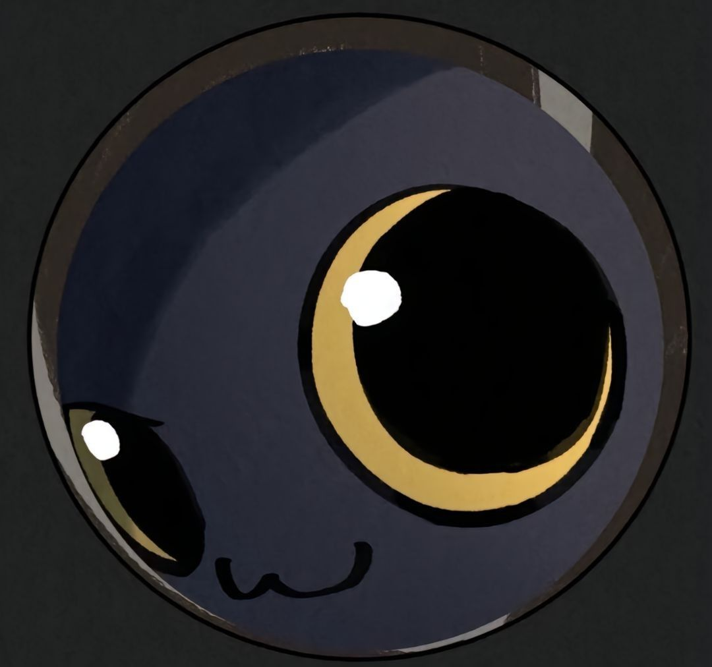

  </img>
  <h6>Hello, I am</h6><h1>Santiago Hernández Sotomonte 👋</h1>

 

<h3 border='0'>Some proyects I have made...</h3>
   

  <a href='https://combinah.itch.io/monera'>
    </img>
  </a>
  &nbsp;&nbsp;&nbsp;&nbsp;&nbsp;&nbsp;&nbsp;&nbsp;
  <a href='https://github.com/Combii0/PyChess'>
    </img>
  </a>
  &nbsp;&nbsp;&nbsp;&nbsp;&nbsp;&nbsp;&nbsp;&nbsp;
  <a href='https://interpoli.vercel.app'>
    </img>
  </a>
  &nbsp;&nbsp;&nbsp;&nbsp;&nbsp;&nbsp;&nbsp;&nbsp;
  <a href='https://school-ways.vercel.app'>
    </img>
  </a>

   
<table><td>

  - 🔭 I’m currently working on [**Renova**](https://renovacol.vercel.app) for the FEDESOFT National contest with other people in representation for the school for second time!

  - 🌱 I’m currently learning **how can AI Agents infuence the development in specific areas like learning and teaching**.

  - ☁️ I've keen interest in VideoGames and Web-Apps. So, I'm learning **Unity** and **TypeScript**

  - 💬 Ask me about **Python, Web Tech, Next.js and Unity**!

  - 📫 Feel free to reach me out **santililchyn0@gmail.com**

  - 🏠 Don't hesitate to drop me a **👋** on Discord –  [**Combinah**](https://discordapp.com/users/756268192506052661)!

</td></table>
   
</img>
   
</img>
